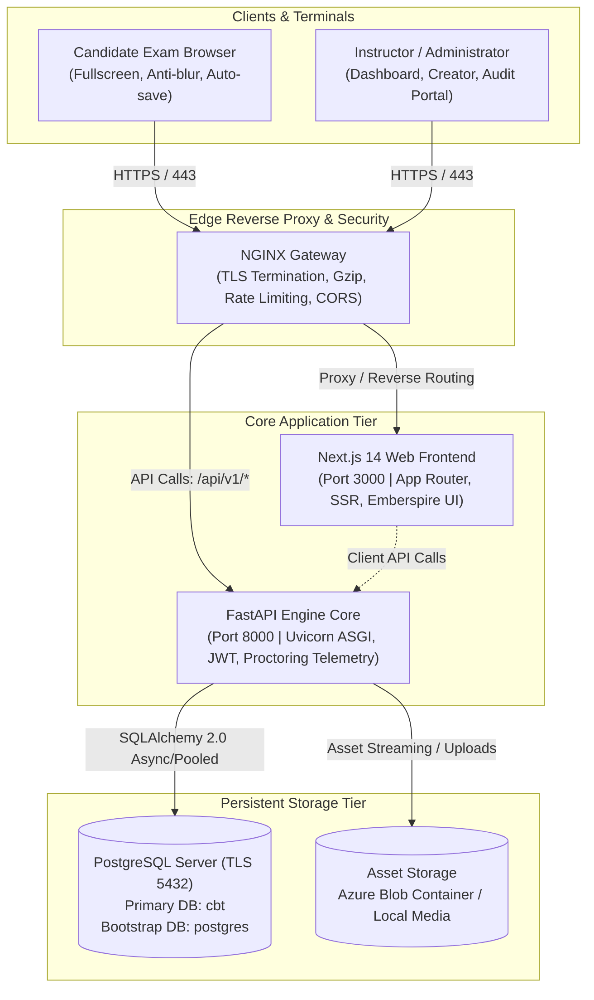
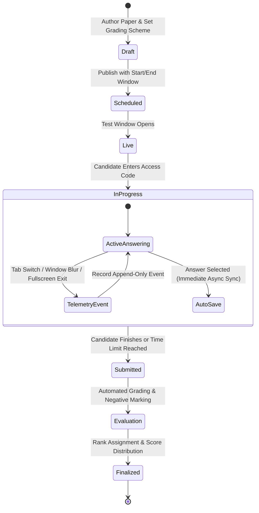
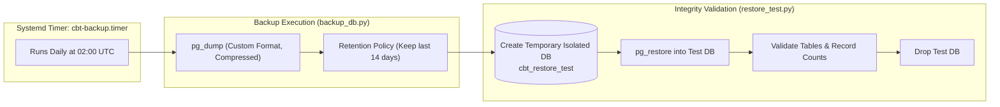

# Computer-Based Testing (CBT) Platform

[](https://fastapi.tiangolo.com)
[](https://nextjs.org)
[](https://www.postgresql.org)
[](https://www.typescriptlang.org)
[](https://www.python.org)
[](#)

A high-performance, enterprise-grade Computer-Based Testing (CBT) and Examination Management Platform built for high-concurrency university exams, competitive test series, and automated assessment workflows.

Featuring low-latency real-time state preservation, non-adversarial browser proctoring and audit telemetry, multi-subject analytics, automated ranking, and resilient database bootstrapping.

---

## 1. System Architecture



### Component Breakdown

| Tier | Component | Technology | Responsibility | Port / Protocol |
| :--- | :--- | :--- | :--- | :--- |
| **Edge Proxy** | Reverse Proxy | NGINX | SSL/TLS termination, rate limiting, request forwarding, gzip compression | `80` (HTTP), `443` (HTTPS) |
| **Web Frontend** | UI & Exam Console | Next.js 14 (React 18) | Candidate examination workspace, admin dashboard, analytics & live monitoring | `3000` (Internal) |
| **Backend API** | Business & Engine | FastAPI (Python 3.12) | Authentication, question banks, real-time response persistence, telemetry audit | `8000` (Internal) |
| **Database** | Primary Store | PostgreSQL 15+ | Relational schemas, candidate attempts, test series, question pools, audit logs | `5432` (TLS Required) |
| **Blob Storage** | Media Assets | Azure Blob / Local | Storage for exam diagram attachments, figures, and exports | HTTPS / Local Mount |

---

## 2. Examination Lifecycle & Integrity Workflow



### Session Integrity & Proctoring Telemetry

The platform includes an objective, non-adversarial session integrity monitoring subsystem. Candidate actions are recorded in an append-only audit trail:

| Event Type | Trigger Condition | Teacher Context & Action |
| :--- | :--- | :--- |
| `TAB_SWITCHED` | Browser tab switch or window unfocus event | Flagged if frequency exceeds threshold (>2) |
| `FULLSCREEN_EXITED` | Candidate exits lock-in fullscreen mode | Alerted for teacher review |
| `MULTIPLE_TAB_DETECTED` | Candidate initiates a concurrent session | Immediate review recommendation triggered |
| `INACTIVITY_STARTED` / `ENDED` | Idle time with no mouse/keyboard activity | Accumulated idle time computed and displayed |
| `NETWORK_DISCONNECTED` / `RESTORED` | Client connectivity interruptions | Preserves attempt state; prevents data loss |
| `PAGE_REFRESHED` | Hard page reloads | Restores state from server cache seamlessly |

---

## 3. Directory Layout

```
/opt/cbt/
├── backend/                      # FastAPI Application Root
│   ├── alembic/                  # Database migration version scripts
│   ├── app/
│   │   ├── api/v1/               # Versioned REST API endpoints (tests, attempts, auth)
│   │   ├── core/                 # App configuration, security tokens, database engine
│   │   ├── models/               # SQLAlchemy declarative relational entities
│   │   ├── schemas/              # Pydantic validation and serialisation schemas
│   │   └── services/             # Core business logic (grading, integrity, analytics)
│   ├── alembic.ini               # Alembic configuration
│   └── requirements.txt          # Python dependencies
├── frontend/                     # Next.js Application Root
│   ├── app/                      # App router (Admin portal, Candidate console, Login)
│   ├── components/               # Reusable UI widgets, calculators, modals
│   ├── lib/                      # API client, TypeScript interfaces, utilities
│   └── package.json              # Node dependencies & build pipelines
├── deployment/                   # Deployment Templates
│   ├── nginx/cbt.conf            # Hardened NGINX reverse proxy configuration
│   └── systemd/                  # cbt-backend, cbt-frontend, cbt-backup systemd units
├── scripts/                      # Operational & Maintenance Utilities
│   ├── production.sh             # Master production manager (start, stop, deploy, logs)
│   ├── create-admin.sh           # Interactive idempotent administrator creation
│   ├── shutdown.sh               # Graceful service shutdown utility
│   ├── backup_db.py              # Automated compressed PostgreSQL backup generator
│   └── restore_test.py           # Isolated test runner for backup verification
├── logs/                         # Production application & error logs
├── backups/                      # Encrypted/compressed database dump archives
├── .env                          # Production environment secrets (chmod 600)
└── README.md                     # Operator and developer documentation
```

---

## 4. Environment Configuration

Production secrets are defined in `/opt/cbt/.env`. Ensure strict file permissions:

```bash
chmod 600 /opt/cbt/.env
```

### Configuration Variables Matrix

| Parameter | Type | Default | Description |
| :--- | :--- | :--- | :--- |
| `APP_ENV` | String | `production` | Environment name (`development`, `staging`, `production`) |
| `APP_DEBUG` | Boolean | `false` | Enable detailed stack traces and debug output |
| `POSTGRES_HOST` | String | *Required* | Managed PostgreSQL hostname (`<your-db-host>.postgres.database.azure.com`) |
| `POSTGRES_PORT` | Integer | `5432` | PostgreSQL listening port |
| `POSTGRES_USER` | String | *Required* | Database administrative username |
| `POSTGRES_PASSWORD` | String | *Required* | Database authentication password |
| `POSTGRES_BOOTSTRAP_DATABASE` | String | `postgres` | Maintenance database used for startup provisioning checks |
| `POSTGRES_DATABASE` | String | `cbt` | Target application database for user accounts, exams, and logs |
| `POSTGRES_SSLMODE` | String | `require` | SSL connection enforcement mode |
| `SECRET_KEY` | String | *Required* | High-entropy 64+ character secret key for JWT session cryptography |
| `SESSION_COOKIE_NAME` | String | `cbt_admin_session` | HTTP-only cookie name for administrative sessions |
| `STORAGE_BACKEND` | String | `local` | Attachment storage mechanism (`local` or `azure`) |
| `AZURE_STORAGE_CONNECTION_STRING` | String | *Optional* | Connection string for Azure Blob Storage integration |
| `AZURE_STORAGE_CONTAINER_NAME` | String | `exam-assets` | Target blob container name |

---

## 5. Production Deployment Guide

Follow this standard procedure for deploying on a fresh Ubuntu 22.04 / 24.04 LTS instance:

### Step 1: System Packages & Service User Setup
```bash
sudo apt update && sudo apt install -y python3 python3-venv python3-pip nodejs npm nginx postgresql-client curl git
sudo useradd -r -s /bin/bash -d /opt/cbt cbt || true
sudo mkdir -p /opt/cbt && sudo chown -R cbt:cbt /opt/cbt
```

### Step 2: Code Deployment
```bash
cd /opt/cbt
# Deploy codebase via Git clone or archive transfer
sudo chown -R cbt:cbt /opt/cbt
```

### Step 3: Configure Environment Variables
```bash
cp .env.example .env
nano .env  # Configure PostgreSQL credentials, secret keys, and storage backend
chmod 600 .env
```

### Step 4: Python Virtual Environment
```bash
python3 -m venv .venv
.venv/bin/pip install --upgrade pip
.venv/bin/pip install -r requirements.txt
```

### Step 5: Build Frontend Bundle
```bash
cd /opt/cbt/frontend
npm install
npm run build
cd /opt/cbt
```

### Step 6: Install Systemd Units
```bash
sudo cp deployment/systemd/cbt-backend.service /etc/systemd/system/
sudo cp deployment/systemd/cbt-frontend.service /etc/systemd/system/
sudo cp deployment/systemd/cbt-backup.service /etc/systemd/system/
sudo cp deployment/systemd/cbt-backup.timer /etc/systemd/system/

sudo systemctl daemon-reload
sudo systemctl enable cbt-backend cbt-frontend cbt-backup.timer
```

### Step 7: Configure NGINX Reverse Proxy
```bash
sudo cp deployment/nginx/cbt.conf /etc/nginx/sites-available/cbt
sudo ln -sf /etc/nginx/sites-available/cbt /etc/nginx/sites-enabled/
sudo rm -f /etc/nginx/sites-enabled/default
sudo nginx -t
sudo systemctl reload nginx
```

### Step 8: Execute Startup & Database Auto-Bootstrapping
```bash
./scripts/production.sh start
```
*The startup manager connects to the bootstrap database (`postgres`), checks for the existence of the `cbt` application database, provisions it with `autocommit=True` if missing, applies Alembic migrations, and launches services.*

### Step 9: Provision Administrator Account
```bash
./scripts/create-admin.sh
```
*Prompts interactively for Username, Email, Display Name, and Password. Automatically hashes using bcrypt and avoids overwriting existing accounts.*

### Step 10: Verify Health & Deployment
```bash
./scripts/production.sh health
```

---

## 6. Daily Operations & CLI Reference

All common administrative tasks can be managed via `./scripts/production.sh`:

```bash
# Check service health and running processes
./scripts/production.sh status

# Gracefully start all services (with DB bootstrap and migrations)
./scripts/production.sh start

# Stop all services without impacting external databases
./scripts/production.sh stop

# Restart application processes
./scripts/production.sh restart

# Tail live application and audit logs
./scripts/production.sh logs

# Execute on-demand encrypted database backup
./scripts/production.sh backup

# Validate backup integrity via isolated test restoration
./scripts/production.sh restore-test

# Pull latest commits, install dependencies, rebuild, and reload
./scripts/production.sh deploy
```

---

## 7. Database Resiliency & Backup Strategy



- **Zero-Downtime Backups**: Database dumps are captured via `pg_dump -Fc` using dedicated read transactions.
- **Isolated Restoration Audits**: `restore_test.py` tests restoration into an isolated transient schema to guarantee zero backup corruption.
- **Auto-Bootstrapping**: Resolves multi-process concurrent startup collisions (`DuplicateDatabase` / `42P04`) during cluster initialization.

---

## 8. Diagnostic & Troubleshooting Matrix

| Issue | Potential Cause | Remediation Procedure |
| :--- | :--- | :--- |
| **502 Bad Gateway** | Backend service offline or port collision | Check status via `./scripts/production.sh status`. Inspect logs with `sudo journalctl -u cbt-backend -n 50`. Verify port `8000` via `ss -tulpn \| grep 8000`. |
| **PostgreSQL Connection Refused** | Firewall rules or incorrect host | Verify `POSTGRES_HOST` in `.env`. Ensure Azure/cloud firewall permits the VM's outbound IP. Test with `psql -h <POSTGRES_HOST> -U <POSTGRES_USER> -d postgres`. |
| **Database Permission Denied (42501)** | Missing `CREATEDB` privilege | Ensure database user has creation privileges, or provision `cbt` directly in cloud portal prior to startup. |
| **Admin Login Rejected** | Session cookie misconfiguration or wrong credentials | Verify admin exists via `./scripts/create-admin.sh`. Ensure `SESSION_COOKIE_SECURE=true` is only enabled over valid HTTPS. |
| **Assets Fail to Upload** | Storage permissions or bad connection string | Check `STORAGE_BACKEND` in `.env`. For Azure Blob, ensure `AZURE_STORAGE_CONNECTION_STRING` has valid SAS or access key tokens. |

---

## 9. Security & Hardening Standards

- **Append-Only Telemetry**: Candidate activity logs and audit records are immutable.
- **Password Hashing**: Cryptographic one-way hashing with salted `bcrypt`.
- **Session Security**: HTTP-only, SameSite strict cookies with customizable secure flags.
- **Least-Privilege Systemd Units**: Dedicated system user `cbt` with restricted shell and filesystem permissions (`chmod 600 .env`).
- **TLS Enforcement**: Enforced TLS 1.2/1.3 at both edge proxy and PostgreSQL data layers.

---

*Computer-Based Testing Platform — Built for scale, security, and examination integrity.*
